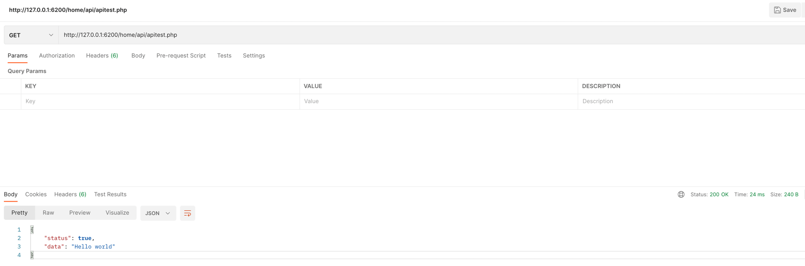

Pure PHP Restful-API Interface
===
***
### Restful API Interface for PHP. This is the last resort in codition of these

1. You need to do web project but can't use except PHP
2. You want to use PHP Restful API(like Laravel) but can't use because of project base condition
3. You want to use only pure "PHP" for rest api
4. You need to interlock PHP with android or other platform and web with composure
***
- Author : Hoplin
- Written : 2022 / 11 / 21
***
### Warning
- PHP Version required upper than 5.4
- Only JSON type supported. **XML type not supported**
***
### How to use?
1. Git clone project
    ```shell
    git clone https://github.com/J-hoplin1/PHP-RestAPI-Interface.git .
    ```

2. Write php file
    ```php
    <?php
    
    include_once "RestAPI/RestAPI.php"
    
    class apitest extends restful_api{
        protected static function GET()
        {
            return self::buildResultJSON("Hello world");
        }
    }
    
    apitest::listen();
    ```
3. Make a test(`Insomnia` or `Postman`... etc)

   
***
### How to write API?

1. First include RestAPI.php
2. Declare class with extending `restful_api`

    ```php
    <?php
    include_once "RestAPI/RestAPI.php"
    
    class apitest extends restful_api
    ?>
    ```

3. Declare `protected static function` with name of HTTP Method. Supported method are these

   - GET
   - POST
   - PUT
   - DELETE

4. Return type should be `json encoded` liked type. You can define your own but recommend to use `restful_api.buildResultJSON` static method
   - `buildResultJSON` require two parameter
     1. data : **`Default is " "`**. Data you want to make as JSON payload
     2. statuscode : **`Default is 200`**. Status code of response. Usage of this parameter are like this under below
     
     ```php
     <?php
        include_once "rest_api_interface.php";

        class apitest extends restful_api{
            protected static function POST()
            {
                return self::listen("POST REQUEST",201);
            }
        }

        apitest::listen();
     ?>
     ```

   - Basically `restful_api.buildResultJSON` have json field format of these
     ```json
        {
            "success": (boolean : true or false),
            "data": (payload data)
        }
     ```

5. **Important : You need to add `echo (class name you defined)::listen($_SERVER['REQUEST_METHOD'])` for api listening**
